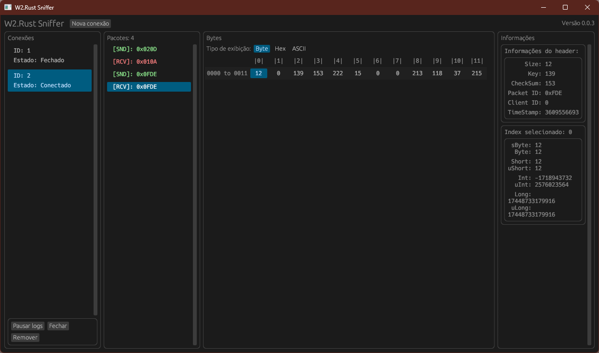

# W2.Rust

Um conjunto de aplicativos para emular e gerenciar um servidor de W2.

## Aplicativos

| Nome                | Categoria   | Link                         |
| ------------------- | ----------- | ---------------------------- |
| [Server](#server)   | Emulador    | [apps/server](apps/server)   |
| [Manager](#manager) | Gerenciador | [apps/manager](apps/manager) |
| [Sniffer](#sniffer) | Ferramenta  | [apps/sniffer](apps/sniffer) |

### Server

Emulador do W2;

### Manager

Usado para gerenciar o **Server**;

### Sniffer

Usado para interceptar pacotes enviados e recebidos do cliente do W2;

## Bibliotecas

| Nome    | Sobre                                                                          | Link                         |
| ------- | ------------------------------------------------------------------------------ | ---------------------------- |
| Enc/Dec | Responsável por cuidar da criptografia da comunicação entre cliente e servidor | [libs/enc_dec](libs/enc_dec) |
| Packets | Centralização das estruturas da comunicação entre cliente e servidor           | [libs/packets](libs/packets) |

## Colaborando

Para colaborar com o projeto é simples, basta cloná-lo em sua conta GitHub, _alterar/adicionar/fixar_ algo ao código e criar um **Pull Request**!
